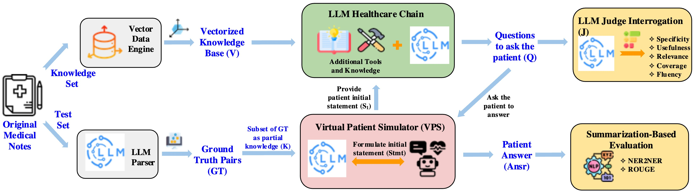

# **HealthQ: Benchmarking Questioning Capabilities of LLM Healthcare Chains**
[](https://conferences.computer.org/chase2025/)  
*Accepted as a regular paper at the 2025 IEEE/ACM Conference on Connected Health: Applications, Systems, and Engineering Technologies (CHASE). See you in New York this summer!*

---

## **📜 Abstract**
Effective patient care in digital healthcare requires large language models (LLMs) that not only answer questions but also actively gather critical information through well-crafted inquiries. This paper introduces **HealthQ**, a novel framework for evaluating the questioning capabilities of LLM healthcare chains. By implementing advanced LLM chains, including **Retrieval-Augmented Generation (RAG), Chain of Thought (CoT), and reflective chains**, HealthQ assesses how effectively these chains elicit comprehensive and relevant patient information.

To achieve this, we integrate an **LLM judge** to evaluate generated questions across metrics such as **specificity, relevance, and usefulness**, while aligning these evaluations with traditional Natural Language Processing (NLP) metrics like **ROUGE and Named Entity Recognition (NER)-based set comparisons**. We validate HealthQ using two custom datasets constructed from public medical datasets, **ChatDoctor and MTS-Dialog**, and demonstrate its robustness across multiple LLM judge models, including **GPT-3.5, GPT-4, and Claude**.

Our contributions are threefold:
1. We present the **first systematic framework** for assessing questioning capabilities in healthcare conversations.
2. We establish a **model-agnostic evaluation methodology**.
3. We provide **empirical evidence linking high-quality questions to improved patient information elicitation**.

---

## **🔑 Configuration: Adding API Keys**
HealthQ requires API keys for **LLM inference and evaluation**. You must set up API keys before running the framework.

### **1. Using a `.env` File (Recommended)**
- Create a `.env` file in the project root directory.
- Add the following API keys:
  ```ini
  GROQ_API_KEY=your_groq_api_key_here
  ANTHROPIC_API_KEY=your_anthropic_api_key_here
  ```
- The framework will automatically read from this file.

### **2. Setting Environment Variables Manually**
- **Linux/Mac**:
  ```bash
  export GROQ_API_KEY="your_groq_api_key_here"
  export ANTHROPIC_API_KEY="your_anthropic_api_key_here"
  ```
- **Windows (PowerShell)**:
  ```powershell
  $env:GROQ_API_KEY="your_groq_api_key_here"
  $env:ANTHROPIC_API_KEY="your_anthropic_api_key_here"
  ```

### **3. Hardcoding (Not Recommended)**
Modify `main.py` and replace placeholders:
```python
import os
os.environ["GROQ_API_KEY"] = "your_groq_api_key_here"
os.environ["ANTHROPIC_API_KEY"] = "your_anthropic_api_key_here"
```

### **Where Are API Keys Used?**
- **`groq_local.py`** → Loads the `Groq` API for local LLM inference.
- **`claude.py`** → Uses the `Anthropic Claude API` for LLM judge evaluation.
- **`eval_dataset_groundtruth_lavita.py`** → Calls Claude-3 for processing medical notes.

### **Security Warning ⚠️**
- **Never commit API keys** to GitHub.
- Always use `.env` or environment variables instead of hardcoding.
- If an API key is exposed, **revoke it immediately**.

---

## **📌 System Framework**
<p align="center">
    
</p>

**Figure 1:** The HealthQ framework systematically evaluates **LLM healthcare chains** by:
1. Extracting structured **Ground Truth Pairs (GT)** from **original medical notes**.
2. Using a **Virtual Patient Simulator (VPS)** to generate **realistic patient interactions**.
3. Generating **questions (Q)** using **LLM Healthcare Chains** (e.g., RAG, ReAct).
4. Evaluating the generated questions using:
   - **LLM Judge Interrogation** (e.g., **specificity, usefulness, relevance**).
   - **Summarization-Based Evaluation** (**NER2NER, ROUGE**).

---

## **📂 Repository Structure**
```
├── healthq_framework.py     # Core implementation of HealthQ framework.
├── workflows/               # Implements RAG, ReAct, and CoT workflows.
│   ├── workflows.py         # Defines various LLM questioning workflows.
│   ├── hardcoded_workflow.py # Implements a simple rule-based baseline.
├── evaluation/              # Evaluation metrics and utilities.
│   ├── judge.py             # LLM judge evaluation (specificity, fluency, etc.).
│   ├── _metric.py           # Privacy and content similarity analysis.
│   ├── _get_metric_dict.py  # Defines evaluation tasks (ROUGE, NER-based scoring).
│   ├── NER_as_tool.py       # Named Entity Recognition (NER) tool for extracting symptoms & medications.
├── data/                    # Input datasets and processed files.
│   ├── hf_data_no_auth.py   # Loads open-source medical datasets.
│   ├── eval_dataset_groundtruth_lavita.py # Prepares ground truth pairs.
├── main.py                  # Main script to run evaluations.
├── results/                 # Stores generated outputs and logs.
│   ├── questions/           # Generated LLM questions per workflow.
│   ├── metrics_summary.json # Final evaluation results.
└── README.md                # Documentation.
```

---

## **🚀 Quick Start**
### **Step 1: Install Dependencies**
```bash
pip install -r requirements.txt
```

### **Step 2: Prepare Datasets**
Ensure that the **ChatDoctor** and **MTS-Dialog** datasets are placed in the `data/` directory.

### **Step 3: Run Evaluation**
```bash
python main.py
```
This will evaluate all workflows and generate logs in the `results/` directory.

---

## **📄 Citation**
If you find this work useful, please cite:

```bibtex
@misc{wang2025healthqunveilingquestioningcapabilities,
      title={HealthQ: Unveiling Questioning Capabilities of LLM Chains in Healthcare Conversations}, 
      author={Ziyu Wang and Hao Li and Di Huang and Hye-Sung Kim and Chae-Won Shin and Amir M. Rahmani},
      year={2025},
      eprint={2409.19487},
      archivePrefix={arXiv},
      primaryClass={cs.CL},
      url={https://arxiv.org/abs/2409.19487}, 
}
```

---

## **📬 Contact**
For questions or collaboration inquiries, please contact:

📧 **Ziyu Wang** – *ziyuw31@uci.edu*

🔥 **See you at CHASE 2025 in New York this summer!** 🚀
